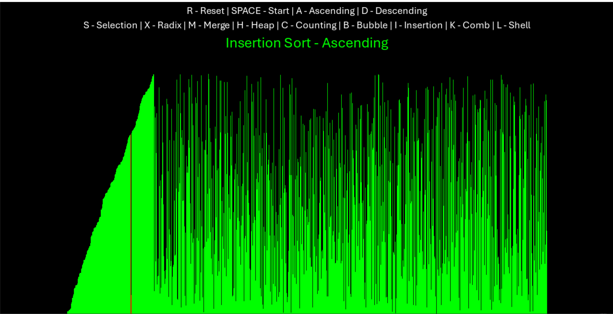

# Sorting Visualizer 🧮

<iframe src="https://www.linkedin.com/embed/feed/update/urn:li:ugcPost:7229753542264160256?compact=1" height="399" width="710" frameborder="0" allowfullscreen="" title="Embedded post"></iframe>

## Overview 📃

This python project was inspired by **[Green Code Sorting Algorithm Video]("https://www.youtube.com/watch?v=N4JVT3eVBP8")**. This python program contain all the popular sorting algoritms visualization by using **`pygame`** and python **`generators`**

# Sorting Algorithms 🧮

| Bubble Sort                           | Selection Sort                              | Insertion Sort                   | Merge Sort                          | Comb Sort                         |
| ------------------------------------- | ------------------------------------------- | -------------------------------- | ----------------------------------- | --------------------------------- |
|  |  |  |  |  |

| Radix Sort                          | Counting Sort                             | Quick Sort                          | Heap Sort                         | Shell Sort                          |
| ----------------------------------- | ----------------------------------------- | ----------------------------------- | --------------------------------- | ----------------------------------- |
|  |  |  |  |  |

## Depedencies 📦

1. **Python** 🐍
2. **Pygame** 🎮

<div align="center">
   <a href="https://www.python.org/">
      
  </a>
  <a href="https://www.pygame.org/news">
      
  </a>
</div>

###

```bash
pip install pygame

```

## Getting Started 🚀

1. Download the Whole repository 📁 or
2. Clone the Repository via git

```bash
git clone https://github.com/ahmedyar7/Sorting-Visualizer.git

```

3. Make sure the dependencies are met ✅
4. Run main.py file

```bash
python main.py
```

## Project Struture 🏗️

1. **`sorting_algorithms.py`** 📜

   - This file contain class `SortingAlgorithms` that contain the algorithms in form of methods

2. **`draw_info.py`** 🖼️

   - This file contain the information about the screen and bars rendering.

3. **`visualization.py`** 🖍️

   - This file contain class `Visualization` that contain two methods
   - `draw()` contain rendering information about the controls/ options rendering and calls the `draw_list()` to draw the actual array
   - `draw_list()` This contain the information about the rendering of the list on to the screen.

4. **`program.py`** 🦾

   - This file contain class `Program` that contain the actual driver code for the whole program, this file import stuff from all other program files.

   - `play_sound() & stop_sound()` These function takes care of playing & stoping of sound
   - `driver_program()` This function provides with the game loop and the keystrokes functionality to the program.

5. **`main.py`** 🚦
   - This file import the `Program` class and the run the object of that class

## Contributions🤝

Contributions are what make the open source community such an amazing place to learn, inspire, and create. Any contributions you make are greatly appreciated.

- Fork the Project
- Create your Feature Branch (`git checkout -b feature/AmazingFeature`)
- Commit your Changes (`git commit -m 'Add some AmazingFeature'`)
- Push to the Branch (`git push origin feature/AmazingFeature`)
- Open a Pull Request

## License ⚖

[MIT LICENSE](LICENSE)
